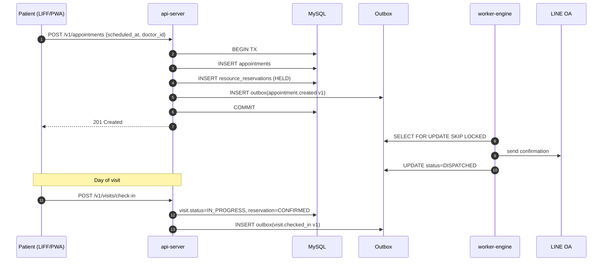
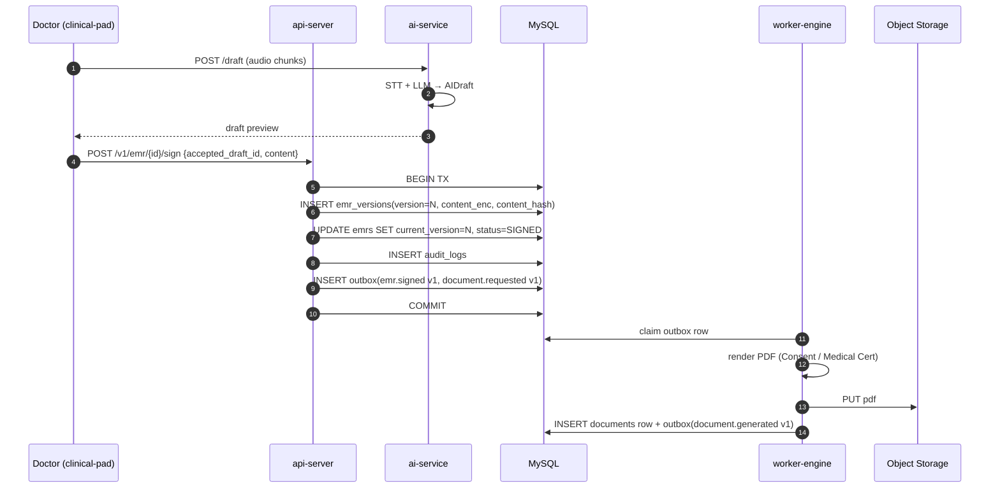
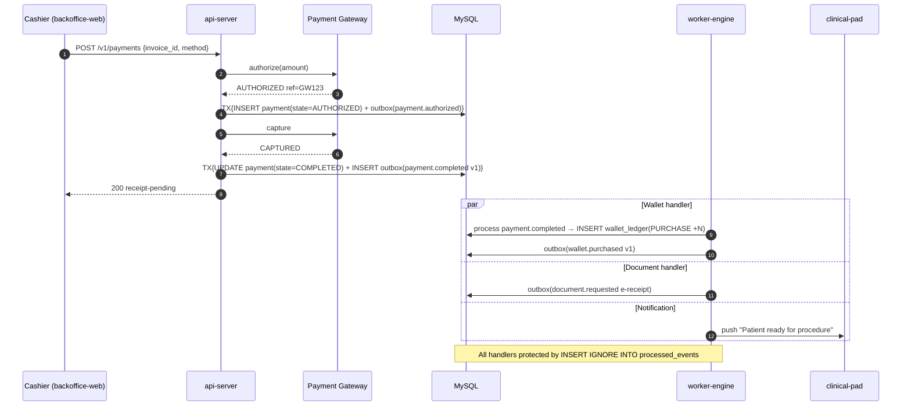
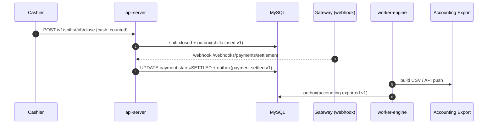
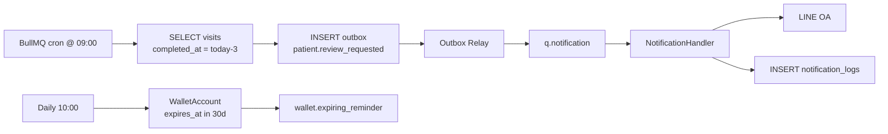
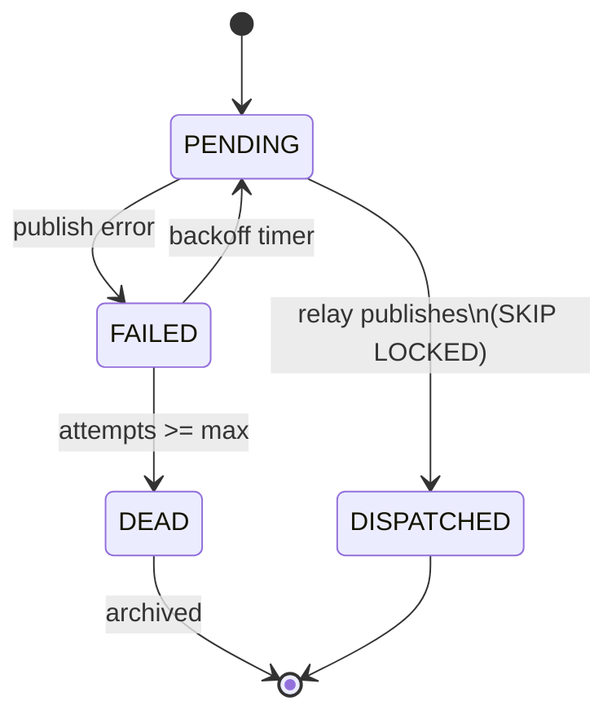
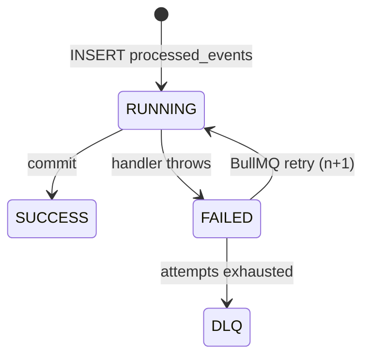

# 🗺️ LegacyX — Sequence Diagrams (User Journey)

Mermaid diagrams covering the critical flows. Open this file in any Markdown viewer with Mermaid support (GitHub, VS Code Markdown Preview Mermaid extension).

---

## 1. Booking → Check-in (Phase 1)



---

## 2. EMR Sign + Document Generation (Phase 2)



---

## 3. Payment Completed → Stock Cut + Wallet (Phase 3-4)

This is the most safety-critical flow.



### Procedure completion (BOM cut)

```mermaid
sequenceDiagram
    autonumber
    participant Pad as clinical-pad
    participant API as api-server
    participant DB as MySQL
    participant W as worker-engine

    Pad->>API: POST /v1/procedures/{id}/complete
    API->>DB: TX{procedure.status=COMPLETED + outbox(procedure.completed v1)}
    W->>DB: lookup BOM by procedure_code
    W->>DB: TX{
    Note right of DB: For each component:<br/>INSERT stock_ledger(BOM_USAGE, -qty, balance_after)<br/>INSERT wallet_ledger(USE, -1)<br/>INSERT doctor_fees(ACCRUED)<br/>INSERT outbox(inventory.adjusted, wallet.used, doctor.fee.accrued)
    }
    W->>W: schedule cron T+24h aftercare LINE
```

---

## 4. Reversal Chain (Phase 5)

Trigger: cashier voids invoice after a procedure was started but cancelled mid-way.

```mermaid
sequenceDiagram
    autonumber
    participant Mgr as Manager
    participant API as api-server
    participant DB as MySQL
    participant W as worker-engine

    Mgr->>API: POST /v1/invoices/{id}/void {reason, override?}
    API->>DB: TX{
    Note right of DB: invoice.status=VOIDED<br/>INSERT outbox(invoice.voided v1)<br/>INSERT audit_logs<br/>(if break_glass) INSERT break_glass_overrides
    }
    W->>DB: handle invoice.voided → emit causal events
    W->>DB: payment.refunded → wallet.reversed → stock.reversed → procedure.cancelled → order.cancelled
    Note over W: Each emitted event has causation_id = invoice.voided.event_id
```

---

## 5. End-of-Day & Settlement (Phase 6)



---

## 6. CRM Cron Engine (Phase 7)



---

## 7. Outbox Relay Internal




